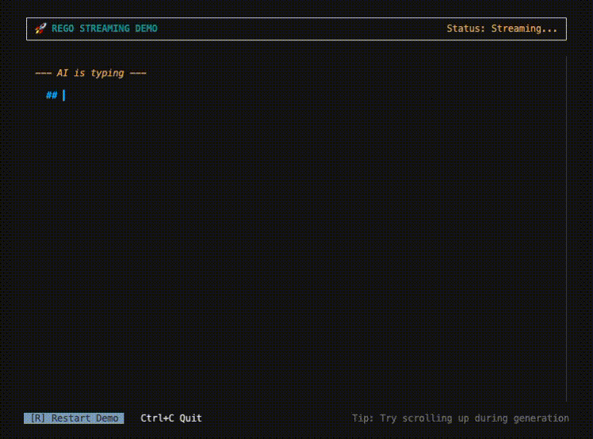

# Rego

[](https://go.dev/)
[](LICENSE)
[](https://goreportcard.com/report/github.com/erweixin/rego)

> 为 Go 生态带来 React Hooks 风格的 CLI/TUI 开发体验

[English](README.md) | 简体中文

<p align="center">
  
</p>

---

## 特性

- **Hooks 风格** - 熟悉的 `Use`, `UseEffect`, `UseKey` 等 API
- **类型安全** - 基于 Go 泛型，编译时类型检查
- **显式 Key** - 突破 React Hooks 调用顺序限制，可在 if/for 中使用
- **声明式 UI** - `VStack`, `HStack`, `Box` 等布局组件
- **焦点管理** - 内置 Tab/Shift+Tab 导航
- **鼠标支持** - 点击、滚轮、悬停事件
- **内置组件** - Button、TextInput、Checkbox、Spinner、Markdown 等
- **Agent 友好** - Bridge 机制，完美支持 AI Agent 流式输出场景

---

## 快速开始

### 安装

```bash
go get github.com/erweixin/rego
```

### Hello World

```go
package main

import (
    "fmt"
    "github.com/erweixin/rego"
)

func App(c rego.C) rego.Node {
    count := rego.Use(c, "count", 0)
    
    rego.UseKey(c, func(key rego.Key, r rune) {
        switch r {
        case '+': count.Set(count.Val + 1)
        case '-': count.Set(count.Val - 1)
        case 'q': c.Quit()
        }
    })
    
    return rego.VStack(
        rego.Text("Rego Counter").Bold(),
        rego.Text(fmt.Sprintf("Count: %d", count.Val)),
        rego.Spacer(),
        rego.Text("[+] 增加  [-] 减少  [q] 退出").Dim(),
    )
}

func main() {
    rego.Run(App)
}
```

运行效果：

```
Rego Counter
Count: 0

[+] 增加  [-] 减少  [q] 退出
```

---

## 核心概念

### Hooks

```go
// 状态管理
count := rego.Use(c, "count", 0)        // 声明状态
count.Set(10)                            // 设置值
count.Update(func(v int) int { return v + 1 }) // 函数式更新

// 副作用
rego.UseEffect(c, func() func() {
    ticker := time.NewTicker(time.Second)
    go func() {
        for range ticker.C {
            c.Refresh()
        }
    }()
    return ticker.Stop  // 返回清理函数
}, dep1, dep2)  // 依赖列表

// 键盘事件
rego.UseKey(c, func(key rego.Key, r rune) {
    if key == rego.KeyEnter { /* ... */ }
    if r == 'q' { c.Quit() }
})

// 鼠标事件
rego.UseMouse(c, func(ev rego.MouseEvent) {
    if ev.Type == rego.MouseEventClick { /* ... */ }
})

// 焦点管理
focus := rego.UseFocus(c)
if focus.IsFocused { /* 当前组件获得焦点 */ }

// 缓存计算
result := rego.UseMemo(c, func() int {
    return expensiveCalculation()
}, dep1, dep2)

// 引用（解决闭包陷阱）
ref := rego.UseRef(c, &someValue)
```

### 子组件

```go
func App(c rego.C) rego.Node {
    return rego.VStack(
        Header(c.Child("header")),   // 独立状态空间
        Content(c.Child("content")),
        Footer(c.Child("footer")),
    )
}

// 列表中使用 index
rego.For(items, func(item Item, i int) rego.Node {
    return ItemComponent(c.Child("item", i), item)
})
```

### 布局

```go
// 垂直堆叠
rego.VStack(
    rego.Text("Title").Bold(),
    rego.Divider(),
    rego.Text("Content"),
    rego.Spacer(),  // 弹性空白
    rego.Text("Footer").Dim(),
)

// 水平排列
rego.HStack(
    rego.Text("Left"),
    rego.Spacer(),
    rego.Text("Right"),
).Gap(2)

// 容器 + 边框
rego.Box(
    rego.Text("Boxed Content"),
).Border(rego.BorderRounded).Padding(1, 2)

// Flex 布局
rego.VStack(
    rego.Text("Header").Height(1),
    rego.Box(content).Flex(1),  // 占据剩余空间
    rego.Text("Footer").Height(1),
)
```

### 样式

```go
rego.Text("Styled Text").
    Bold().
    Italic().
    Underline().
    Color(rego.Cyan).
    Background(rego.Black)

rego.Box(child).
    Border(rego.BorderDouble).
    BorderColor(rego.Green).
    Padding(1, 2).
    Width(40).
    Height(10)
```

---

## 内置组件

### Button

```go
rego.Button(c.Child("btn"), rego.ButtonProps{
    Label:   "Submit",
    Primary: true,
    OnClick: func() { /* ... */ },
})
```

### TextInput

```go
rego.TextInput(c.Child("input"), rego.TextInputProps{
    Value:       value.Val,
    Placeholder: "请输入...",
    OnChanged:   func(s string) { value.Set(s) },
    OnSubmit:    func(s string) { /* 回车提交 */ },
})
```

### Checkbox

```go
rego.Checkbox(c.Child("check"), rego.CheckboxProps{
    Label:     "同意条款",
    Checked:   agreed.Val,
    OnChanged: func(v bool) { agreed.Set(v) },
})
```

### Spinner

```go
rego.Spinner(c.Child("loading"), "加载中...")
```

### ScrollBox / TailBox

```go
// 可滚动容器
rego.ScrollBox(c.Child("scroll"), longContent)

// 自动滚动到底部（适合日志/聊天）
rego.TailBox(c.Child("logs"), logContent)
```

### Markdown

```go
rego.Markdown("# Hello\n\nThis is **markdown** content.")
```

---

## AI Agent 场景

Rego 特别适合构建 AI Agent CLI，内置 Bridge 机制能够完美处理流式输出与智能滚动：



```go
func AgentUI(c rego.C) rego.Node {
    bridge := rego.UseBridge[AgentState, Question, Answer](c, AgentState{})
    
    rego.UseEffect(c, func() func() {
        go agent.Run(bridge.Handle())  // 后台运行 Agent
        return nil
    })
    
    return rego.VStack(
        // 渲染流式输出
        rego.Markdown(bridge.State().Response),
        
        // 渲染交互请求（如确认对话框）
        rego.When(bridge.HasInteraction(),
            ConfirmDialog(c.Child("confirm"), bridge),
        ),
    )
}
```

更多详情请参考 [Agent Bridge 文档](docs/AGENT_BRIDGE_ZH.md)。

---

## 示例

| 示例 | 说明 |
|------|------|
| [showcase](examples/showcase) | ⭐ 功能展示，最佳入门示例 |
| [hello](examples/hello) | 最简单的 Hello World |
| [counter](examples/counter) | 计数器，展示状态管理 |
| [todo](examples/todo) | Todo 应用，完整功能演示 |
| [timer](examples/timer) | 定时器，展示 UseEffect |
| [focus](examples/focus) | 焦点切换，多面板应用 |
| [form](examples/form) | 表单，展示内置组件 |
| [dashboard](examples/dashboard) | 仪表盘，复杂布局 |
| [agent](examples/agent) | AI Agent，流式输出 |
| [stream](examples/stream) | 流式输出与智能滚动演示 |
| [markdown](examples/markdown) | Markdown 渲染 |
| [gallery](examples/gallery) | 组件画廊，全部组件展示 |

运行示例：

```bash
cd examples/counter
go run main.go
```

---

## 技术架构

```
┌─────────────────────────────────────────────────────────────┐
│                        用户代码                              │
│   func App(c rego.C) rego.Node { ... }                      │
└──────────────────────────┬──────────────────────────────────┘
                           │
┌──────────────────────────▼──────────────────────────────────┐
│                     rego (核心层)                            │
│                                                             │
│  • C 接口 - 组件上下文                                       │
│  • State[T] - 泛型状态管理                                   │
│  • Hooks - Use, UseEffect, UseKey, UseMemo, UseRef, UseFocus│
│  • Node - 声明式视图节点                                     │
│  • Context[T] - 跨组件上下文传递                             │
│                                                             │
└──────────────────────────┬──────────────────────────────────┘
                           │
┌──────────────────────────▼──────────────────────────────────┐
│                     tcell (渲染层)                           │
│                                                             │
│  • 终端初始化/恢复                                           │
│  • 屏幕渲染 + 内置 Diff                                      │
│  • 键盘/鼠标事件                                             │
│  • 跨平台支持                                                │
│                                                             │
└─────────────────────────────────────────────────────────────┘
```

---

## 与其他方案对比

| 特性 | Rego | bubbletea | tcell |
|------|------|-----------|-------|
| 架构 | Hooks | Elm (MVU) | 命令式 |
| 状态管理 | `rego.Use()` 细粒度 | Model 集中 | 手动 |
| 副作用 | `rego.UseEffect()` | Cmd | 手动 |
| 条件中用状态 | 可以 | - | - |
| 类型安全 | 泛型 | 需断言 | - |
| 焦点管理 | `rego.UseFocus()` | 手动 | 手动 |
| 学习曲线 | React 开发者友好 | 需学 Elm | 较陡 |

---

## 文档

- [API 参考](docs/API_ZH.md) - 完整的 API 文档
- [组件开发指南](docs/COMPONENTS_ZH.md) - 如何编写自定义组件
- [样式系统指南](docs/STYLING_ZH.md) - 颜色、边框、布局详解
- [Agent Bridge](docs/AGENT_BRIDGE_ZH.md) - AI Agent 集成指南

---

## 开发

```bash
# 克隆仓库
git clone https://github.com/erweixin/rego.git
cd rego

# 运行测试
go test ./...

# 运行示例
cd examples/gallery
go run .
```

---

## 路线图

- [x] 核心 Hooks 运行时
- [x] 基础布局组件
- [x] 焦点管理系统
- [x] 鼠标支持
- [x] 内置组件库
- [x] Markdown 渲染
- [x] Agent Bridge
- [ ] Select/Dropdown 组件
- [ ] Table 组件
- [ ] Modal 组件
- [ ] 主题系统

---

## 贡献

欢迎贡献！请阅读 [贡献指南](CONTRIBUTING.md)。

---

## License

MIT License - 详见 [LICENSE](LICENSE)

---

## 致谢

- [tcell](https://github.com/gdamore/tcell) - 底层终端库
- [glamour](https://github.com/charmbracelet/glamour) - Markdown 渲染
- [React Hooks](https://react.dev/reference/react) - 设计灵感

---

<p align="center">
  <sub>Made with love for the Go community</sub>
</p>
